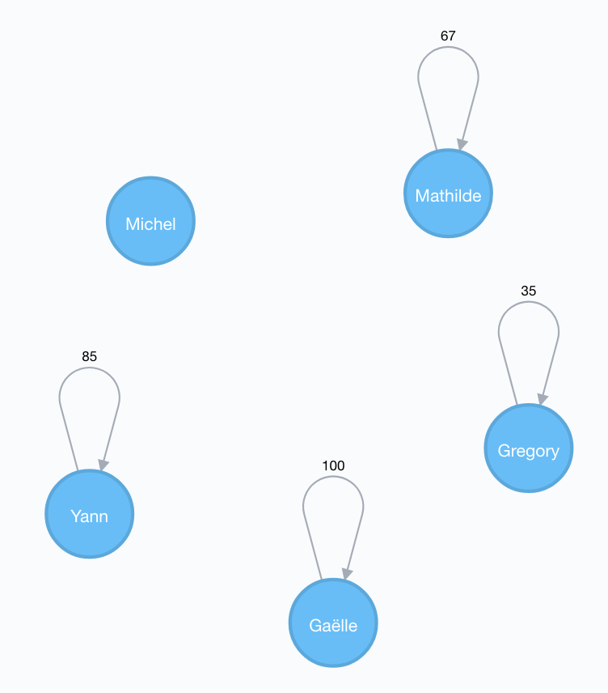
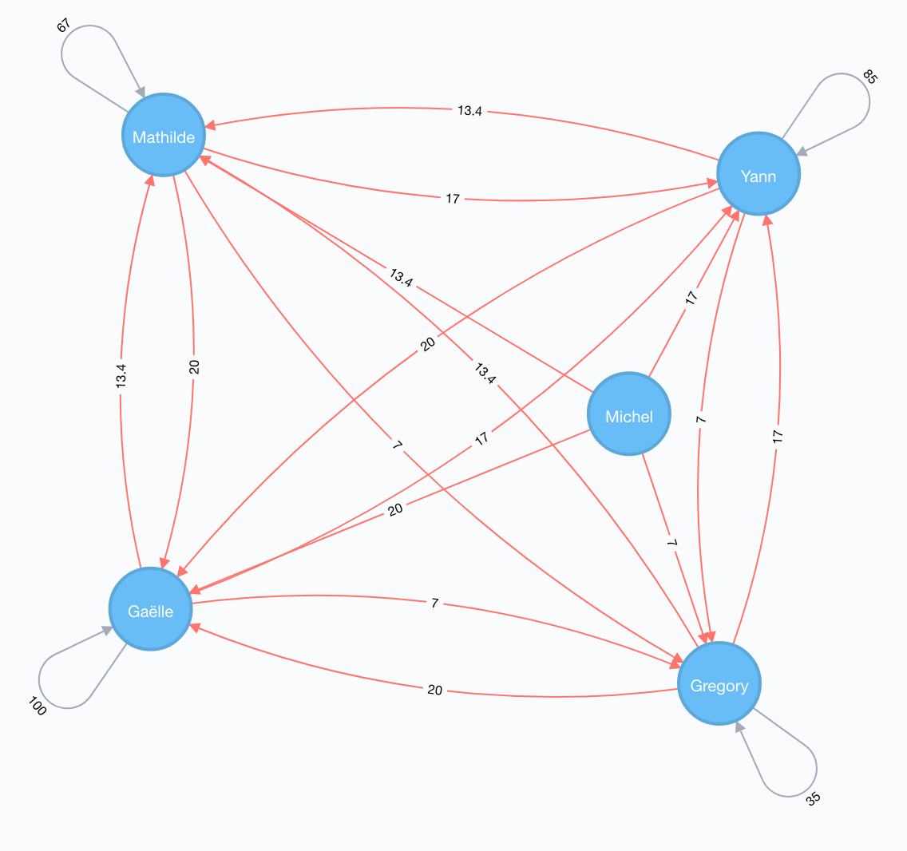
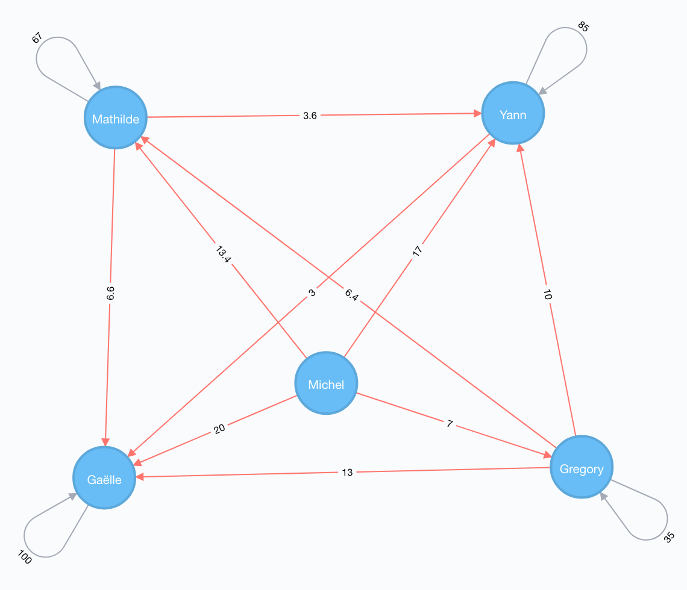
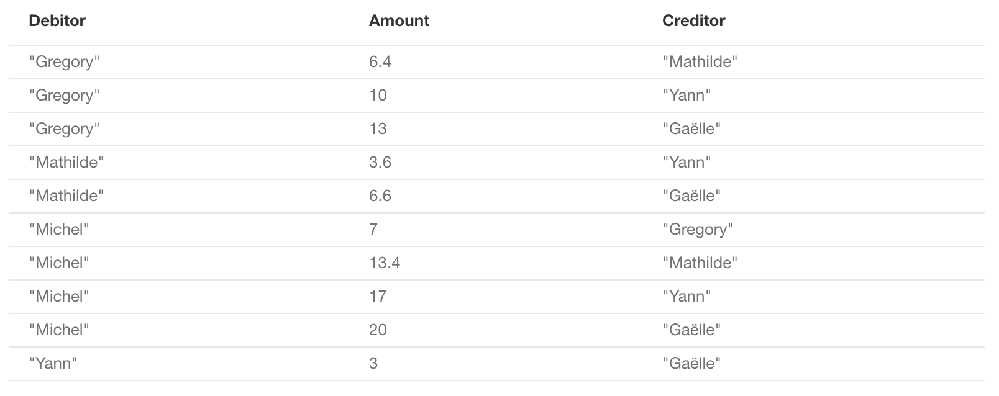

#  Expenses - Neo4j

## Abstract

The idea of this Saturday afternoon "couch-workshop" came from a common case where a group of persons individually bring food supplies for a party.

Then come the point where everybody must pay to everybody else for what he·she owes (A owes €€€ to B, B owes €€€ to C, etc.).

The more persons, the more challenging it is, leading sometimes to some confusing situations. I used to solve this equation using a spreadsheet, and then came Graph Databases, and [Neo4j](https://neo4j.com).

## The Problem

Let's pretend we have a total of **five** persons coming to our party : Gaëlle, Gregory, Mathilde, Michel and Yann.

Their expenses are:

| Person | Expense |
|---|---|
| Gaëlle | 100€ |
| Gregory | 35€ |
| Mathilde | 67€ |
| Michel | 0€ |
| Yann | 85€ |

## Initializing the Database

The following Cypher query will create the persons (nodes) and their expenses (using a self relationship):

```cypher
CREATE
(gaelle:Person {name: "Gaëlle"}),
(gregory:Person {name: "Gregory"}),
(mathilde:Person {name: "Mathilde"}),
(michel:Person {name: "Michel"}),
(yann:Person {name: "Yann"}),
(gaelle)-[:SPENT {amount: 100}]->(gaelle),
(gregory)-[:SPENT {amount: 35}]->(gregory),
(mathilde)-[:SPENT {amount: 67}]->(mathilde),
(yann)-[:SPENT {amount: 85}]->(yann);
```

*Note: the expense could have been stored as a property of the person. The relationship was preferred as the expense represents an action (described with a verb) rather than a characteristic of the person.*



## Adding the Debt Relationship

The following Cypher query will add a relationship between two persons to indicate how much the first person owes to the second one.

```cypher
MATCH (p:Person)
WITH toFloat(count(p)) AS GuestsCount
MATCH (s:Person)
MATCH (t:Person)
MATCH (s)-[r:SPENT]-(s)
WHERE s <> t
CREATE (t)-[:OWES_TO {amount: round(r.amount / GuestsCount * 100) / 100}]->(s);
```



*The OWES_TO relationship appears in red.*

## Simplifying Mutual Debts

As in real life, if two persons owe some money to each other, we merge the two transactions into a single one.

This is done with the following Cypher query:

```cypher
MATCH (s)-[r1:OWES_TO]->(t)
MATCH (t)-[r2:OWES_TO]->(s)
WHERE r1.amount - r2.amount > 0
// Create a new merged transaction...
CREATE (s)-[:OWES_TO {amount: round((r1.amount - r2.amount) * 100) / 100}]->(t)
// ...Then delete the previous ones
DELETE r1
DELETE r2;
```

The output reports:

```
Set 6 properties, deleted 12 relationships, created 6 relationships.
```



## Getting the Bill

Our last Cypher query summarizes each person debt:

```cypher
MATCH ()-[r:OWES_TO]->()
WITH
    startNode(r).name AS Debitor,
    endNode(r).name AS Creditor,
    r.amount AS Amount
RETURN Debitor, Amount, Creditor
ORDER BY Debitor, Amount;
```



Only the first query needs to be modified to fit your own case.

Enjoy your party! :-)
